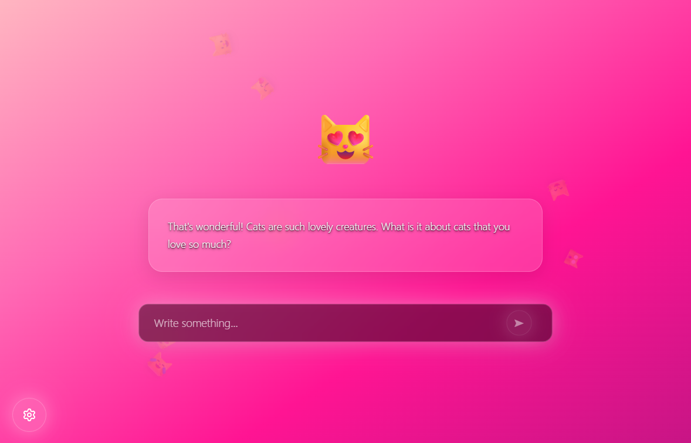
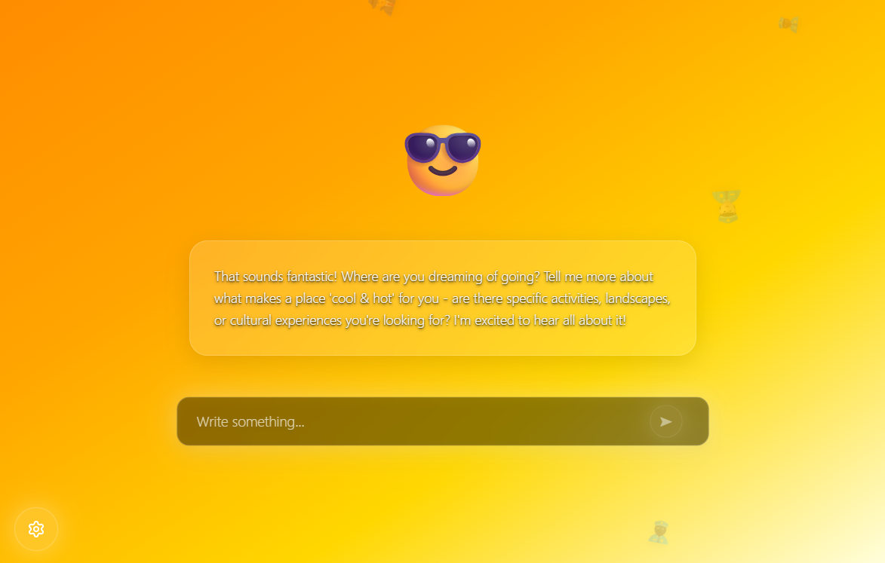
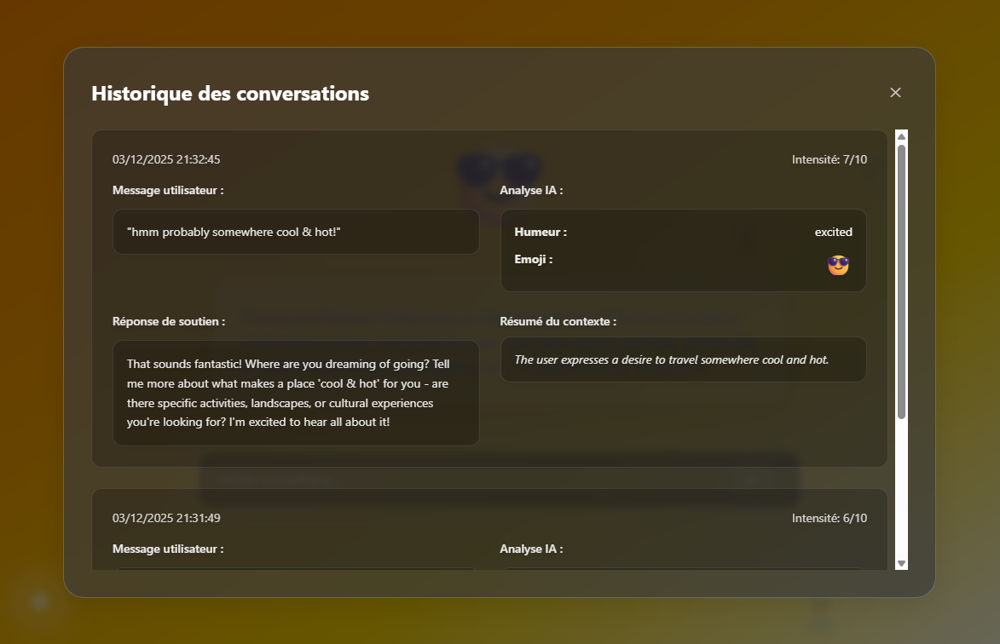
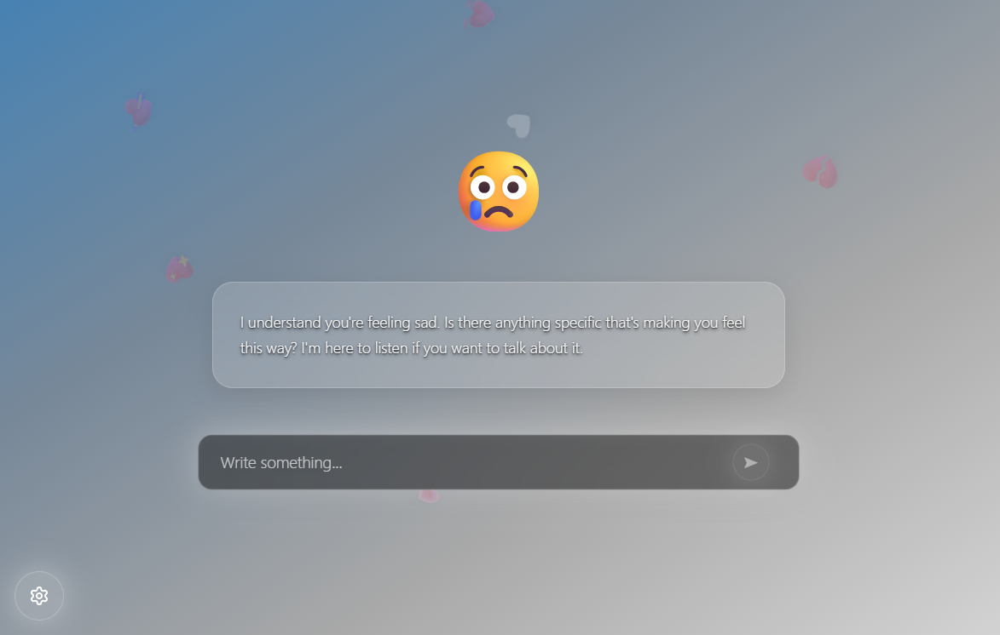

<div align="center">

<!-- Logo -->


<br/>

### *Your AI-powered mood companion*

<br/>

[](https://www.electronjs.org/)
[](https://react.dev/)
[](https://www.typescriptlang.org/)
[](https://tailwindcss.com/)
[](https://deepmind.google/technologies/gemini/)

<br/>

[Getting Started](#getting-started) · [Architecture](#system-architecture) · [Configuration](#configuration-surface) · [Packaging](#packaging-notes)

---

</div>

<br/>

# Feel — Gemini-Assisted Mood Companion

Feel is a desktop application built with Electron, React, and TypeScript that interprets free-form user messages, infers emotional tone through Google Gemini, and renders a responsive UI that mirrors the detected mood. The renderer and main processes are fully isolated, and all inter-process data flows through typed controllers to keep the AI integration and presentation layer decoupled.

---

## Screenshots

<div align="center">
<table>
<tr>
<td></td>
<td></td>
</tr>
<tr>
<td></td>
<td></td>
</tr>
</table>
</div>

---

## Core Capabilities

- Gemini-backed analysis pipeline that validates responses, enforces JSON schemas, and enriches the UI with mood metadata.
- Adaptive interface built on Tailwind CSS, DaisyUI, and custom animation layers that drive gradients, emoji animations, and conversational feedback.
- Persistent conversation history stored in compressed localStorage, with import/export, cleanup, and quota handling.
- Multi-language UX (French/English) with runtime model switching and configurable typewriter speed.
- Hardened Electron surface through context isolation, preload-only environment exposure, and a strict Content Security Policy.

## System Architecture

- **Main process** (`src/main/index.ts`): owns the `BrowserWindow`, applies CSP headers, and keeps the application menu disabled for kiosk-style deployments.
- **Preload bridge** (`src/main/preload.ts`): exposes only the `GEMINI_API_KEY` via `contextBridge`, preserving isolation from Node primitives.
- **Renderer** (`src/renderer`): React 18 + TypeScript, bundled with Electron Forge’s Webpack plugin. UI state originates from `useApplicationController`, which wraps a set of pure classes under `src/renderer/classes`.
- **Domain controllers**:
  - `ApplicationController` orchestrates Gemini calls, emoji retrieval, persistence, and UI state mutations.
  - `MoodAnalyzer` enforces the prompt contract, handles API errors, validates color payloads, and maintains conversation context.
  - `EmojiManager` pulls emoji groups from EmojiHub, generates floating emoji layers, and caches responses.
  - `StorageManager` compresses histories, guards against storage quota overruns, and exposes lifecycle tooling (import/export/cleanup).
  - `UIStateManager` maintains gradient layering, animation selection, and emoji presentation.
- **Typed data contracts** live in `src/types/types.ts`, ensuring the Gemini payload and UI state stay consistent across React components, controllers, and persistence.

### Analysis Pipeline

1. `UserInputArea` captures a message and delegates it to `handleSubmit` inside `useApplicationController`.
2. `ApplicationController.processMessage` issues a Gemini request, validates the structured response, and records it in the conversation history.
3. `EmojiManager` derives a palette of floating emojis based on Gemini’s grouping and prepares animation metadata.
4. `UIStateManager` rotates background gradients, emoji animations, and layered renders so the UI reflects the inferred mood.
5. `StorageManager` persists the updated history with compression and surfaces metrics through `getStatistics` for export or diagnostics.

## Requirements

- Node.js 18 or later
- npm or yarn
- Google Gemini API key with access to the configured model (defaults to `gemini-1.5-flash` in `appConstants`).

## Getting Started

```powershell
git clone <repository-url>
cd Feel
npm install
Copy-Item .env.development .env.local
notepad .env.local  # set GEMINI_API_KEY=<your key>
npm start
```

`npm start` launches Electron Forge in development mode with hot reload enabled. The Gemini key is read at runtime through the preload bridge; no `.env` data leaks into the renderer bundle.

### Alternative Entrypoints

- `npm run start:web` – serves the renderer bundle in a web browser via `webpack-dev-server` for rapid UI iteration without Electron.
- `npm run make` – produces platform-specific installers using Electron Forge makers (`squirrel`, `zip`, `deb`, `rpm`).
- `npm run package` – generates unpackaged binaries for manual distribution.

## Configuration Surface

- **Environment**: `GEMINI_API_KEY` (required). Extend `preload.ts` if additional secrets must be bridged, but keep context isolation enabled.
- **Build tooling**: Webpack configs live under `config/webpack/`, with environment separation (`main`, `renderer`, `web`). Tailwind and PostCSS configuration reside in `config/tailwind.config.js` and `config/postcss.config.js`.
- **Path aliases**: Defined in `config/tsconfig.json` (`@classes`, `@components`, `@types`, etc.) and mirrored in the Webpack alias configuration.
- **Electron Forge**: `config/forge.config.js` wires the bundled entry points and enables auto-unpack of native modules.

## Runtime Behaviour

- **Security posture**: Node integration is disabled, `contextIsolation` is enabled, and CSP restricts network calls to Gemini and EmojiHub endpoints.
- **Persistence**: Histories are stored in localStorage as compressed base64 strings. `StorageManager` auto-recovers from quota overruns and provides cleanup utilities.
- **Error handling**: `GeminiAPIError` captures HTTP status, human-friendly messages, and network exceptions to keep the renderer responsive.
- **Internationalisation**: Language selection flows through `ApplicationController.setLanguage`, and translations live in `src/utils/translations.tsx`.

## Project Layout

```
src/
├─ main/            # Electron entry point and preload bridge
├─ renderer/
│  ├─ classes/      # Controllers, analysers, storage, UI state
│  ├─ components/   # React UI broken into domain-specific folders
│  ├─ hooks/        # React hooks (useApplicationController, etc.)
│  ├─ styles/       # Tailwind base styles and bespoke animations
│  └─ utils/        # Translation catalogues and helper utilities
├─ types/           # Shared TypeScript contracts
└─ utils/           # Cross-layer utilities (if needed)
```

## Development Tooling

- `npm run lint` – ESLint with the project’s custom config under `config/eslint.config.js`.
- `npm run lint:fix` – applies autofixes.
- `npm run format` – Prettier for TypeScript, JavaScript, JSON, and CSS inside `src/`.
- Tailwind classes are purged according to the paths declared in `tailwind.config.js`, so keep new UI files inside the tracked directories.

## Packaging Notes

- Release builds run under `NODE_ENV=production`, activating the Electron Forge `fuses` plugin to strip devtools and disable Chromium features not required at runtime.
- The main bundle is emitted to `.webpack/main`, and the renderer bundle is produced under `.webpack/renderer`. Installers land in the `out/` directory.
- Update the `productName` in `package.json` before distributing signed builds.

## Extending the Application

- Add new mood visualisations by extending `UIStateManager` and wiring components through `useApplicationController`.
- Surface additional Gemini metadata by expanding `GeminiMoodResponse` in `src/types/types.ts` and adjusting `MoodAnalyzer.validateResponse`.
- Introduce alternative storage backends by implementing a new persistence class and injecting it into `ApplicationController`.
- When adding new APIs, extend the CSP and the preload bridge deliberately; avoid enabling full Node integration.

## Troubleshooting

- Blank responses typically indicate a missing or invalid `GEMINI_API_KEY`; verify the value injected through the preload bridge.
- If the UI shows a generic error, inspect the developer tools console (`Ctrl+Shift+I`) for detailed `GeminiAPIError` logs.
- Storage quota issues trigger automatic cleanup, but you can manually call `StorageManager.cleanup()` via the console for diagnostics.

## License

Feel is released under the MIT License. Review `package.json` for author metadata and update attribution before public distribution.